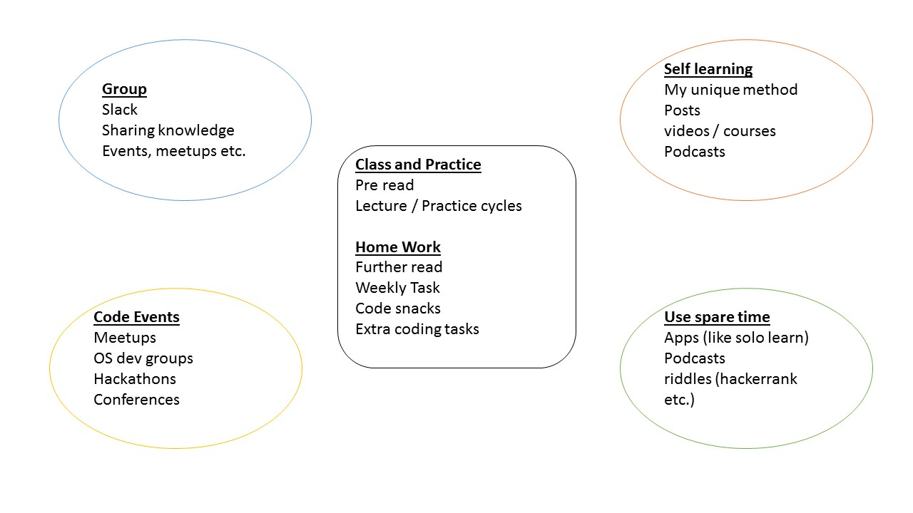

# Module 1 Lesson 01
## Web Introduction
(This document is optimized for presentation using [reveal-md](https://github.com/webpro/reveal-md))

---

## Overview
It's all about building a (learning) system... that works!

### Agenda
1. How the program works
2. Hello HTML + CSS
- Break - Pizza party
3. Hello Javascript
4. Hello git (rainbow practice)

---

### How the program works
<div>
    
</div>

---

### Hello HTML
HTML rules and semantics
- they are so many of them... don't get confused!
- [doctype](https://www.w3schools.com/tags/tag_doctype.asp)
- head ([base](https://www.w3schools.com/tags/tag_base.asp), [meta](https://www.w3schools.com/tags/tag_meta.asp), [title](https://www.w3schools.com/tags/tag_title.asp), [link](https://www.w3schools.com/tags/tag_link.asp), [script](https://www.w3schools.com/tags/tag_script.asp))
- body
    - flow ( [block vs inline](https://www.w3schools.com/html/html_blocks.asp) )
    - elements semantics (`a`,`img`, lists, `header`, `footer`, `nav`,`h1`-`h6`, `p`, `i`, `div`, `span`, `select`, `input` etc)

---

### Hello CSS
- Cascading means...?
- CSS [selectors and points](https://css-tricks.com/specifics-on-css-specificity/)
- display property (again - block vs inline, none, and more!)
- [box model](https://www.w3schools.com/css/css_boxmodel.asp)
- body
    - flow (block vs inline)
    - elements semantics (h1-6, p, div, span etc)


---

### Hello HTML + CSS: Class Practice
Create and style a page which contains:
- head title
- a question line
- 5-8 lines of texts (answer option)
- input + button
<div>
    
</div>


---

### Hello Javascript
- good practice: use strict, always terminate statements. compare by type.
- Data types: Undefined, Null, Boolean, Number, String, Symbol, Object 
- Variables: var / const / let
- Loops: while, for, forEach (avoid using for in)
- Comparing types
- Objects: literals, constructor, nested properties
- Arrays
- Functions
- DOM

---

### Hello git
<div style="float: left">
    
</div>
important terms:

commit, branch, master, merge, local repository

---

### Hello git
important terms:
- current branch / HEAD
- fork
- clone
- pull / push
- downstream / upstream 
- stash
- [conflicts](https://help.github.com/articles/resolving-a-merge-conflict-using-the-command-line/)

---

### Hello git - Working with PRs
1. fork repo class-practice
2. clone the repo to your local machine: 
```
git clone https://github.com/MY_NAME/class-practice
```
3. create branch:   ***git checkout -b MY_NAME***
4. make changes
5. add changes to git:    ***git add -A***
6. commit changes: ***git commit -m "MY FIRST COMMIT"***
7. push to your repo:  ***git push origin MY_NAME***
8. open PR to origin ('upstream') repo


---

### Further read:
1. go through *all* link in today's lesson, research the terms you've learned
2. [css3 flexbox](https://www.w3schools.com/css/css3_flexbox.asp)
2. [A Complete Guide to Flexbox](https://css-tricks.com/snippets/css/a-guide-to-flexbox/)

### Home Work:
weekly task: build and design a web calculator
fork and PR: ***home-practice/m1.lesson1.web_calculator***

extra:
solve levels 1-2 at [checkio](https://checkio.org/)


