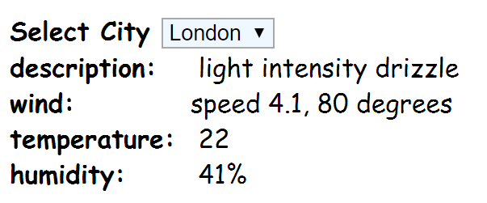

## Module 1 Lesson 09
### Working with API: leaflet & OpenWeatherAPI
(This document is optimized for presentation using [reveal-md](https://github.com/webpro/reveal-md))

---

### Prep
* [REST API intro](https://internet-israel.com/%D7%9E%D7%93%D7%A8%D7%99%D7%9B%D7%99%D7%9D/rest/rest-%D7%94%D7%A7%D7%93%D7%9E%D7%94/)

### Agenda
1. The concept of API
2. Web API 1: OpenWeatherMap
3. Web API 2: Leaflet
4. A Word about bootstrap

---

### The concept of API
* [API](https://www.youtube.com/watch?v=s7wmiS2mSXY) - how programs "talk" to each other
<!-- .element: class="fragment" -->

* A set of commands provided by developers, for higher-level developers
<!-- .element: class="fragment" -->

* Not only for the WEB - [Programming Languages](https://docs.oracle.com/javase/7/docs/api/) and [Code Libraries](http://api.jquery.com/) have API, [OS](https://www.kernel.org/doc/html/v4.12/core-api/kernel-api.html), [firmware](https://developer.nvidia.com/nvapi) etc.
<!-- .element: class="fragment" -->

* You've already used it [before](https://jsonplaceholder.typicode.com)
<!-- .element: class="fragment" -->

* [WEB API != REST != HTTP](https://stackoverflow.com/questions/28703093/what-exactly-is-the-difference-between-web-api-and-rest-api-in-mvc)
<!-- .element: class="fragment" -->

---

### API 1: [OpenWeatherMap](https://openweathermap.org/api)
* [sign up](https://home.openweathermap.org/users/sign_up)
* get [API token](https://home.openweathermap.org/api_keys)
* [try it!](https://openweathermap.org/current)

---

### API 1: OpenWeatherMap - practice
create a mini-app which display the weather in 5 cities around the world.

    

bonus: add requests [caching](https://whatis.techtarget.com/definition/caching) mechanism

---

### API 2: [Leaflet](http://leafletjs.com/)
* sign up
* get token API
* work according to the [Quick Start Guide](http://leafletjs.com/examples/quick-start/)

---

### API 2: Leaflet - practice
* add a map to your weather mini-app
* follow the practice documentation

---

### A Word about [bootstrap](https://getbootstrap.com/)
* [overview](http://getbootstrap.com/docs/4.0/components/alerts/)
* [Contents](http://getbootstrap.com/docs/4.0/getting-started/contents/)
* [Css reboot](https://scotch.io/tutorials/a-look-at-bootstrap-4s-new-reset-rebootcss#toc-rebootcss)
* [getting started](http://getbootstrap.com/docs/4.0/getting-started/introduction/)
* flexbox vs bootstrap grid
* practice - use bootstrap layout for your mini-app

---

### HW

Finish class practice
