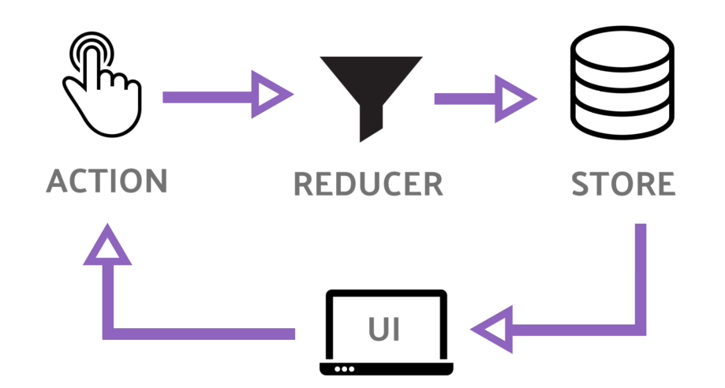

## Module 2 Lesson 7
### Redux 1 (Redux Introduction)

(This document is optimized for presentation using [reveal-md](https://github.com/webpro/reveal-md))

---

### Prep
*[Redux Explain in a simple way](https://www.youtube.com/watch?v=nFryvdyMI8s)
*[Using Redux in Angular - with Mosh](https://www.youtube.com/watch?v=UEcdQR-NoNA) - until 15:00

### Agenda
1. The problem whith large scale applications
2. What is Redux?
3. Let's Build Redux
4. Integrate in simple app

---

### Problems when apps go large
* <!-- .element: class="fragment" -->
As application grows so their complexity.

* <!-- .element: class="fragment" -->
Multiple Components may use the same data. As application grows, services may not be enough.

* <!-- .element: class="fragment" -->
Multiple Components affect the same data (and each other).
They may be in different parts of the app (not always parent child)

* <!-- .element: class="fragment" -->
Spaggethi code create debug hell

* <!-- .element: class="fragment" -->
Saving application state (for later load) seems to be problematic in large apps.

---

### What is Redux?

* <!-- .element: class="fragment" -->
A design pattern (based on flux)

* <!-- .element: class="fragment" -->
redux.js - A Library which implement that design pattern

* <!-- .element: class="fragment" -->
Idea is: let's manage single source of truth, in a predictable way

* <!-- .element: class="fragment" -->
Redux dictate how to store and change youre data, in a loose way
(Has Principles and best practices, but does not enforce them)

---

### What is Redux? - scheme

* store - manage your stuff
* state - object represent app in a specific time
* action - plain object represent an event
* reducer - transform old state + action to a new state

---

### What is Redux? - Rules

* <!-- .element: class="fragment" -->
Principles 1: [Single source of truth](https://redux.js.org/introduction/three-principles#single-source-of-truth)
* <!-- .element: class="fragment" -->
Principles 2+3: [States are immutable](https://redux.js.org/introduction/three-principles#single-source-of-truth)

* <!-- .element: class="fragment" -->
Best Practice #1: Seperate data and UI state
* <!-- .element: class="fragment" -->
Best Practice #2: Keep a flat data structure (like a database)

---

### Let's Build Redux
Live coding and practice
(files in demo library)

---

### Integrate in secret agency app
* Integrate as a service
* use the code like any service
* In real world app - we'll use NgRx

---

### Further reading
* [Angular Redux Middleware](http://webiks.com/angular-redux-middleware/)
* [Using Redux in Angular - with Mosh](https://www.youtube.com/watch?v=UEcdQR-NoNA) - entire video

HW:
* Integrate our redux code in secret agency app
