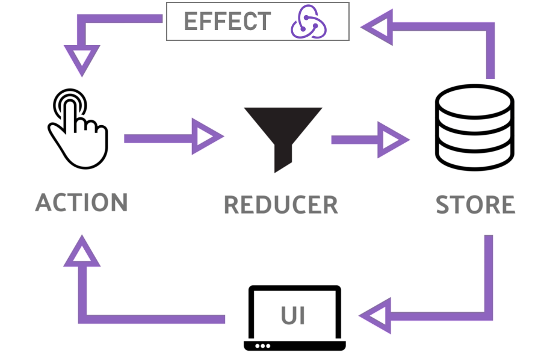

## Module 2 Lesson 8
### Redux 2 (Redux in Angular)

(This document is optimized for presentation using [reveal-md](https://github.com/webpro/reveal-md))

---

### Prep
* optional background - [You will learn RxJS](https://www.youtube.com/watch?v=uQ1zhJHclvs)
* [RxJS Quick Start with Practical Examples](https://www.youtube.com/watch?v=2LCo926NFLI)
* [Angular ngrx Redux Quick Start Tutorial](https://www.youtube.com/watch?v=f97ICOaekNU)

### Agenda
1. What is redux? a Reminder
2. ngrx - RxJS-powered state management library
3. ngrx - ng-books demo
4. Add Ngrx to our secret-agency app
5. Ngrx Effects

---

### What is Redux? - a Reminder


* store - manage your stuff
* state - object represent app in a specific time
* action - plain object represent an event
* reducer - transform old state + action to a new state

---

### ngrx - RxJS-powered state management library
* <!-- .element: class="fragment" -->
Inspired by Redux (ngrx !== Redux.js)

* <!-- .element: class="fragment" -->
RxJS-powered: using [RxJS Observables](https://www.youtube.com/watch?v=uQ1zhJHclvs) (e.g. async actions)

* <!-- .element: class="fragment" -->
So... actions are Observables?
Ahm, no but -

* <!-- .element: class="fragment" -->
Dispatcher (which wrap actions) is a Subject (type of Observable)

* <!-- .element: class="fragment" -->
Listeners are Observable

---

### ngrx - [ng-books demo](https://github.com/demo-projects/ng-books/)
clone [repo](https://github.com/demo-projects/ng-books/) and see different branches (focus on 1-

---

### Add Ngrx to our secret-agency app
* [Installation and setup](https://github.com/ngrx/platform/blob/master/docs/store/README.md#installation)
* Step 1: install
```
npm install @ngrx/store
```
* Step 2: add store module
```
ng g module state --module=app
```

---
### Add Ngrx to our secret-agency app

* Step 3: create state module structure
```
state/state.module.ts
state/agents/agent.model.ts // already exist
state/agents/agent.reducer.ts
state/agents/agent.actions.js
```

---
### Add Ngrx to our secret-agency app

* Step 4: implement AppStateModule in state.module.ts

```
import { StoreModule } from '@ngrx/store';
import { StoreDevtoolsModule } from '@ngrx/store-devtools';
import {agentReducer} from './agent/agent.reducer';

@NgModule({
  imports: [
    StoreModule.forRoot({
      agents: agentReducer,
    }),
    StoreDevtoolsModule.instrument({ maxAge: 25 })
  ]
})
export class AppStateModule { }
```


---
### Add Ngrx to our secret-agency app

* Step 5: implement reducer and actions
```
//actions
import { Action } from '@ngrx/store';

export enum AgentActionTypes {
  ADD_AGENT     = '[Agent] Add Agent',
  REMOVE_AGENT  = '[Agent] remove Agent',
}

export class AddAgent implements Action {
    readonly type = AgentActionTypes.ADD_AGENT;
    constructor(public payload: Agent) {}
}

export type AgentAction =
  AddAgent |
  ...;
```
---

### Add Ngrx to our secret-agency app

* Step 5: implement reducer and actions
```
//reducer
export function agentReducer(
    state: IAgentsState = initUserState,
    action: AgentAction
) {
  switch (action.type) {
    case AgentActionTypes.ADD_AGENT:
      return ...;   // implement logic

    case AgentActionTypes.REMOVE_AGENT:
      return ...;   // implement logic

    default:
      return state;
  }
}
```

---
### Ngrx Effects

what's missing here?


---
### Ngrx Effects




---
### Ngrx Effects
* <!-- .element: class="fragment" -->
(Side) Effects represent - things you want to happen **after** state has updated

* <!-- .element: class="fragment" -->
From the docs: `In @ngrx/effects, effects are sources of actions.`

* <!-- .element: class="fragment" -->
Most of the time - Effects will trigger other functions

* <!-- .element: class="fragment" -->
Another use will be to trigger **async events** (like requesting data from the server)

---

### Ngrx Effects
* Live Demo: [ng-books](https://github.com/demo-projects/ng-books/blob/02_book_browser_feature/src/app/features/book-browser/effects/books.effects.ts)
* Practice:
    - See loader actions and reducer
    - Simulate filter heavy work (use setTimeout)
    - Add effect to toggle loader off/on by
    when filtering / filter done

---

### Further reading
* [Angular Ngrx Effects with Firebase Database](https://www.youtube.com/watch?v=13nWhUndQo4)
* [Learn @ngrx/entity and Feature Modules](https://www.youtube.com/watch?v=8Wy1AqY5gqE)
* [An Intro to ngrx/effects](https://medium.com/front-end-hacking/an-intro-to-ngrx-effects-ngrx-store-with-angular-4-c55c4d1d5baf)
* [Stop using ngrx/effects for that](https://medium.com/@m3po22/stop-using-ngrx-effects-for-that-a6ccfe186399)

HW:
* Finish Adding Ngrx to our secret-agency app