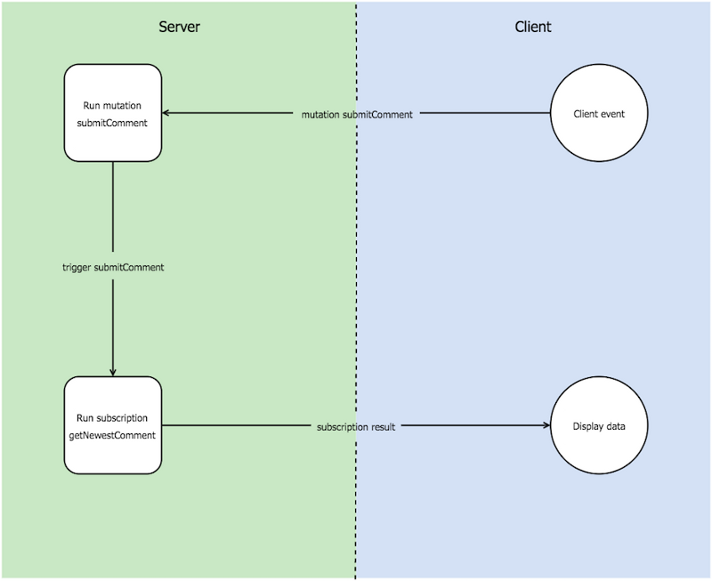

## Module 3 Lesson 6
### GraphQL
(This document is optimized for presentation using [reveal-md](https://github.com/webpro/reveal-md))

---
[GraphQL Tutorial for Beginners]

### Agenda
1. GraphQL Introduction
2. GraphQL and Rest
3. GraphQL main features

    3.1 Basics

    3.2 Advances topics (Self learning)
4. References

---
### GraphQL Introduction
What is GraphQL?
* <!-- .element: class="fragment" --> Declarative data fetching specification

* <!-- .element: class="fragment" --> A query language

---
### The idea !!!
This code is too complected , what should I do ?

    

 <!-- .element: class="fragment" --> Maybe I can create a new query language…

---

 <!-- .element: class="fragment" --> GraphQL created by Facebook to deal with complex data and to reduce number of calls of REST API

 <!-- .element: class="fragment" --> GraphQL released as open source in 2015, and become one of the most adopted technologies in 2018

---
### Why use GraphQL

<!-- .element: class="fragment" --> Single endpoint over http protocol.  Usually  https://myServer/graphql

<!-- .element: class="fragment" --> Support JSON

<!-- .element: class="fragment" --> Simplify client interaction by using well known schema

<!-- .element: class="fragment" --> Strongly type by schema enforcement

<!-- .element: class="fragment" --> Flexible than existing solutions

---

### But we have REST

<!-- .element: class="fragment" -->  GraphQL vs Rest

<!-- .element: class="fragment" --> Single request vs Multiple request

<!-- .element: class="fragment" --> GraphQL is faster : Avoid multiple Rest calls therefore less network

<!-- .element: class="fragment" --> GraphQL support better backward computability than REST

<!-- .element: class="fragment" --> In GraphQL client choose which objects and data to retrieve

---
### A closer look on GraphQL and Rest

---
### REST

    

---
### GRAPHQL

    

---

    

    

---

### So what to choose ???
### Let's first learn GraphQL (-:

---
GraphQL Basics

   <!-- .element: class="fragment" -->  Query

   <!-- .element: class="fragment" -->  Mutation

   <!-- .element: class="fragment" -->  Schema

   <!-- .element: class="fragment" -->  Types

   <!-- .element: class="fragment" -->  Directives

   <!-- .element: class="fragment" -->   Default parameters

---
GraphQL Advanced

   <!-- .element: class="fragment" --> Subscription

   <!-- .element: class="fragment" --> Gzip

   <!-- .element: class="fragment" --> Versioning

   <!-- .element: class="fragment" --> Pagination

   <!-- .element: class="fragment" --> Caching

---
### What you will do
---
###   Play with GraphiQL
---
*   Create “hello world” GraphQL server
        -   Add schema
        -   Add query
        -   Implement resolver
*   Create and Query  server with “complex” data
        -   Add mock data
        -   Add schema
        -   Add query
        -   Implement resolver
*   Add mutation to server
        -   Update schema
        -   Implement mutation resolver
---
*   Build angular application with Apollo client
        -   Connect client to server
        -   Query for data
---

Before we start

In this course we will use GitHub GraphQL Api , please make sure you have access to GitHub Developers site

https://developer.github.com/v4/explorer/

---

Schema

 <!-- .element: class="fragment" --> A schema defines a GraphQL API’s and data types

 <!-- .element: class="fragment" --> Each data type (Object)  is construct from fields

 <!-- .element: class="fragment" --> GraphQL server enforce schema validation

 <!-- .element: class="fragment" --> Contract between server and client

---

Query

 <!-- .element: class="fragment" --> Queries are read operation

 <!-- .element: class="fragment" --> A query must specify a field

 <!-- .element: class="fragment" --> A query can include Fragments  (reusable objects)

 <!-- .element: class="fragment" --> Nested fields – Ability to query for complex data

---
 <!-- .element: class="fragment" --> Time to play with GraphiQL

---
Resolvers

A resolver is an action that maps GraphQL operation to a function.

A resolver is mapped to an action by its operation name.

---
More GraphQL ...

    https://www.youtube.com/watch?v=Y0lDGjwRYKw

---

---
### Types

<!-- .element: class="fragment" --> Int: A signed 32‐bit integer

<!-- .element: class="fragment" --> Float: A signed double-precision floating-point value

<!-- .element: class="fragment" --> String: A UTF‐8 character sequence

<!-- .element: class="fragment" --> Boolean: true or false

---
Enum

    Enum number{

            one
            two
            three
    }
---

Scalar : an object which does not include sub fields

    query {
        viewer {
            login   - login is  scalar
        }
    }

---
#### Interface

Abstract type with set of fields that must be included

        interface Animal {
          id: ID!
          name: String!
        }

        type Dog implements Animal {
          id: ID!
          name: String!
          ….
        }

        type Cat implements Character {
          id: ID!
          name: String!
           …
        }

---
### Directives

Directive are variables operation for altering the schema

@include(if: Boolean) include the field if true.

@skip(if: Boolean) Skip field if the true.

---
### Code time

Download project from GitHub

https://github.com/WEBbeast2018/GraphQL-Class

In the project we have three sub folders

Each folder is focus on GraphQL topic
  - Query
  - Mutation
  - Apollo Client

---
### Subscription

A way for a client to receive an update on data manipulation

A pub / sub concept (Web socket)

---

    

---
### References
    http://graphql.github.io/

    https://developer.github.com/v4/

    https://en.wikipedia.org/wiki/GraphQL

    And more…

    https://github.com/chentsulin/awesome-graphql#lib-js

---
### So what to choose ...

Use REST if you needs to deal with single resources or always retrieve all data set of a resource

Use GraphQL if you want to retrieve multiple data from different resources

----

### HW / Class
You HW is to impalement a GraphQL subscription

    Requirement:
    Retrieve information on a new user creation over subscription

          - Define subscription schema
          - Add subscription ability to your server application
          - Add subscription ability to your client application
          - Change existing code to update users on user creation

     How to start

     https://www.npmjs.com/package/graphql-subscriptions
     
     https://www.apollographql.com/docs/apollo-server/features/subscriptions.html