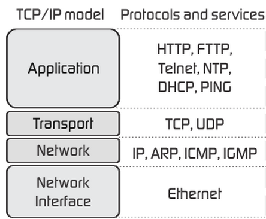

## Module 3 Lesson 7
### More about Network Protocols
(This document is optimized for presentation using [reveal-md](https://github.com/webpro/reveal-md))

---

### Prep

### Agenda
1. TCP/IP
2. Websocket
3. HTTPS

---
### The 4 layers model


---
### [TCP/IP](https://he.wikipedia.org/wiki/TCP/IP)
* <!-- .element: class="fragment" -->[TCP: Transmission Control Protocol](https://he.wikipedia.org/wiki/Transmission_Control_Protocol) (vs UDP - User Datagram Protocol)

* Provides a communication service at an intermediate level between an application program and the Internet Protocol (IP)
<!-- .element: class="fragment" -->
* Creat connection (handshake), splite data into packets and provide reliable transmission
<!-- .element: class="fragment" -->
* <!-- .element: class="fragment" -->[IP: Internet Protocol](https://he.wikipedia.org/wiki/Internet_Protocol)
* Fast protocol (do not insure reliablity).
<!-- .element: class="fragment" -->

---
### IP address
* <!-- .element: class="fragment" -->IPv4 vs IPv6
```
192.168.0.1                 //IPv4
FE80::0202:B3FF:FE1E:8329   //IPv6
```
* Private IP vs Public IP
<!-- .element: class="fragment" -->
* <!-- .element: class="fragment" -->[NAT: Network Address Translation](https://www.youtube.com/watch?v=QBqPzHEDzvo)
* <!-- .element: class="fragment" -->[Subnet mask](https://he.wikipedia.org/wiki/Subnet_mask)

---
### Websocket
* providing full-duplex communication channels over a single TCP connection
<!-- .element: class="fragment" -->
* It is NOT the same as HTTP. it is HTTP compatible.
<!-- .element: class="fragment" -->

---
### Websocket - practice
* use [socket.io](https://socket.io/)
* start an interval-based counter on the server. incremet counter every 1 second.
* update client for each incremet. display the counter to the user.
* add a reset button. when pressed - counter will reset on server
* all data will be transfered with websocket

---
### [HTTPS](https://he.wikipedia.org/wiki/HTTP_Secure)
* HTTP Secured
<!-- .element: class="fragment" -->
* HTTP + TSL/SSL = HTTPS
<!-- .element: class="fragment" -->
* If everybody can listen to data traffice - How does it works?
<!-- .element: class="fragment" -->
* <!-- .element: class="fragment" -->[HTTPS uses asymmetric key](https://www.youtube.com/watch?v=w0QbnxKRD0w)

* Provide protection against eavesdropping and Tampering
<!-- .element: class="fragment" -->
* Does not protect against Man in the middle attack
<!-- .element: class="fragment" -->

---
### Further read
* [Internet protocol suite](https://he.wikipedia.org/wiki/TCP/IP)
* [How Network Address Translation Works](https://www.youtube.com/watch?v=QBqPzHEDzvo)
* [Rapid Explanation of Subnet Masks](https://www.youtube.com/watch?v=IDLrt-yppbI)
* [HTTPS](https://www.youtube.com/watch?v=w0QbnxKRD0w)