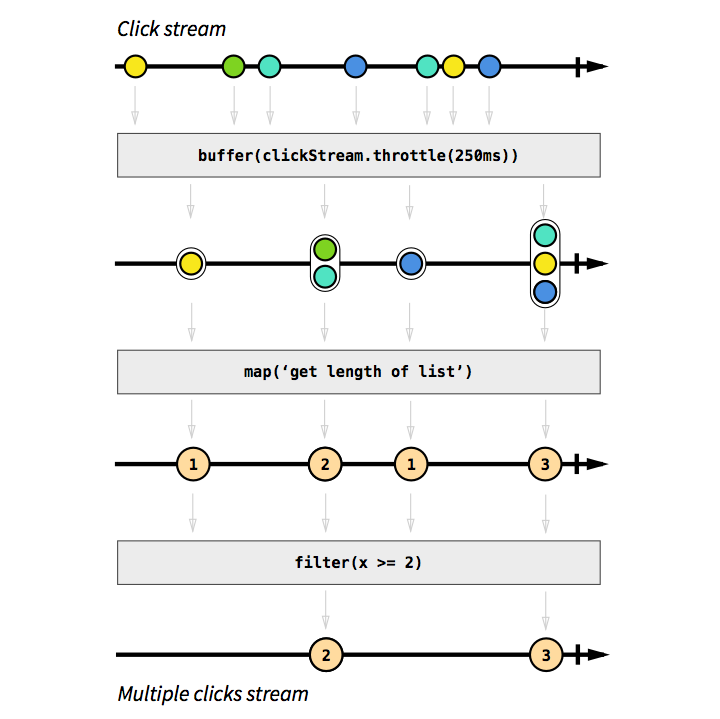

## Module 4 Lesson 3
### RxJS 2/2
(This document is optimized for presentation using [reveal-md](https://github.com/webpro/reveal-md))

---

### Prep
* Finish RxJS 1/2

### Agenda
1. Stream manipulations
2. RxJS Operators
3. Hot vs Cold Observables
4. Subjects
5. Cold to Hot operators
6. Thinking Reactively - Practice time

---
# RXjs Operators

(This document is optimized for presentation using [reveal-md](https://github.com/webpro/reveal-md))

<!-- --- -->

<!-- # Overview -->
<!-- RXjs Operators may be confusing. let's review some of them to understand the logic behind it. -->

<!-- ## Goals -->
<!-- * Understanding stream manipulations -->
<!-- <!--.element: class="fragment"--> -->
<!-- * merge -->
<!-- <!--.element: class="fragment"--> -->
<!-- * flatMap -->
<!-- <!--.element: class="fragment"--> -->
<!-- * Cold to Hot Observable operators -->
<!-- <!--.element: class="fragment"--> -->

---

### Stream manipulations
get a stream => manipulate => return a stream
Example: filter
<div>
    
</div>

---

### RXjs Operators - click stream buffer

<div>
    
</div>


---

### RXjs Operators - chaining

<div>
    
</div>

---

### RXjs Operators - [merge](https://www.learnrxjs.io/operators/combination/merge.html)
<div>
    
</div>

---

## RXjs Operators - [merge](https://www.learnrxjs.io/operators/combination/merge.html)
```
//emit every 2.5 seconds
const first = Rx.Observable.interval(2500);

//emit every 1 second
const second = Rx.Observable.interval(1000);

//used as instance method
const example = first.merge(second);

//output: 0,1,0,2....
const subscribe = example.subscribe(val => console.log(val));

```
* [Live example 1](http://jsbin.com/wuwujokaqu/1/edit?js,console)
* [Live example 2 - click stream](http://jsfiddle.net/staltz/4gGgs/27/)

---

### RXjs Operators - [flatMap](https://www.learnrxjs.io/operators/combination/merge.html)
[Demo Area](https://jsbin.com/xixirof/edit?html,js,console)

Just an ordinary request? (see EX01)...
```
const responseStream = Rx.Observable.fromPromise(
  $.getJSON('https://api.github.com/users/1')
)

responseStream.subscribe(data => console.log(data))
```
---

### Practice time: ex02
* See what is happening in the demo file code
* Fix it!

---

### Practice time: ex02 - solution
* See what ex03 code
* See [flatmap/switchmap explenation](https://www.youtube.com/watch?v=rUZ9CjcaCEw) (3:00 - 6:00; 8:00 - )

---

```

const someElementValue = [1,2];

const responseMetastream = Rx.Observable.from(someElementValue)
    .map( itemValue =>
        Rx.Observable.fromPromise(
            $.get('https://api.github.com/users/' + itemValue)
        )
    );

// metastream - stream of streams...
responseMetastream.subscribe(data => console.log(data))

```
<div>
    
</div>
<!-- .element: class="fragment" -->

---

```
const someElementValue = [1,2];

// flatMap to the rescue!
const responseStream = Rx.Observable.from(someElementValue)
    .flatMap( itemValue =>
        Rx.Observable.fromPromise(
            $.get('https://api.github.com/users/' + itemValue)
        )
    );

responseStream.subscribe(data => console.log(data))
```

<div>
    
</div>
<!-- .element: class="fragment" -->

---
### Practice time: ex04
* Display each todo item as a paragraph with a close button
* When close button is *clicked twice* - remove the item

---

### [Hot vs Cold Observables](https://medium.com/@benlesh/hot-vs-cold-observables-f8094ed53339)

COLD is when your observable creates the producer
(example: per instance timers)
```
    // COLD
    const hot = new Observable((observer) => {
        const producer = new Producer();
      // have observer listen to producer here
    });
```
```
    // COLD
    const source = new Observable((observer) => {
      const socket = new WebSocket('ws://someurl');
      socket.addEventListener('message', (e) => observer.next(e));
      return () => socket.close();
    });
```

---

### [Hot vs Cold Observables](https://medium.com/@benlesh/hot-vs-cold-observables-f8094ed53339)

HOT is when your observable closes over the producer
(example: Mouse clicks)
```
    // HOT
    const producer = new Producer();
    const hot = new Observable((observer) => {
      // have observer listen to producer here
    });
```
```
    // HOT
    const socket = new WebSocket('ws://someurl');

    const source = new Observable((observer) => {
        socket.addEventListener('message', (e) => observer.next(e));
    });
```
Problem: now the observable doesn't hold the control for the websocket (completion, errors etc.)

---

### [Subjects](http://reactivex.io/documentation/subject.html)
Subjects acts both as an observer and as an Observable
It can help us Make A Cold Observable Hot

```
    function makeHot(cold) {
      const subject = new Subject();
      cold.subscribe(subject);
      return new Observable((observer) => subject.subscribe(observer));
    }
```
Note: Subjects cannot be reused

---

### Cold to Hot operators
[Publish vs Share](https://stackoverflow.com/questions/30696262/difference-between-share-and-publish-refcount)

Share
```
    const source = Rx.Observable.range(0, 5).Share();
    const sub1 = source.subscribe(x => console.log("Observer 1: " + x));
    const sub2 = source.subscribe(x => console.log("Observer 2: " + x));
    // Output: 0, 1, 2, 3, 4, 0, 1, 2, 3, 4
```

Publish
```
    const source = Rx.Observable.range(0, 5).publish();
    const sub1 = source.subscribe(x => console.log("Observer 1: " + x));
    const sub2 = source.subscribe(x => console.log("Observer 2: " + x));

    source.connect();
    // Output: 0, 0, 1, 1, 2, 2, 3, 3, 4, 4
```

---
### [Thinking Reactively](https://www.youtube.com/watch?v=3LKMwkuK0ZE&t=385s)
* watch min (1:40 - 5:43)
* ex:

---

## Further reading:
* [refCount](https://blog.angularindepth.com/rxjs-how-to-use-refcount-73a0c6619a4e)
* [RxJS: Understanding the publish and share Operators](https://blog.angularindepth.com/rxjs-understanding-the-publish-and-share-operators-16ea2f446635)
* [Observables, Observers and Operators Introduction](https://toddmotto.com/rxjs-observables-observers-operators)
* [I switched a map and you'll never guess what happened next](https://www.youtube.com/watch?v=rUZ9CjcaCEw)

HW:
* Task 1
